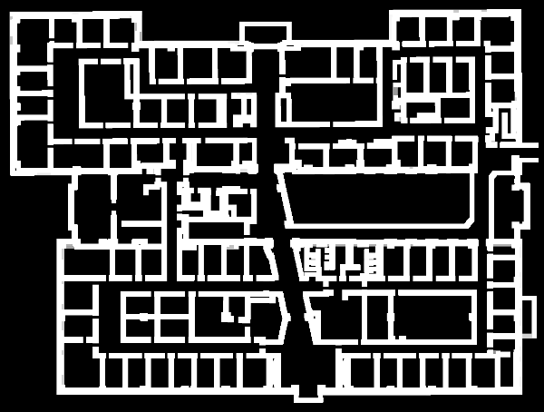

# Assignment 4: A* with Jump-Point Search

## Dependencies
`sudo apt-get install cmake build-essential clang libgoogle-glog-dev  libgflags-dev cimg-dev`

## Build
Run `make`.

## Run
Run `./bin/jps` with the map image, and optional goal and start locations:
`./bin/jps map.png [goal_x goal y [start x start y]]`

Examples:
`./bin/jps maps/nsh4-small-dialated.png`
`./bin/jps maps/nsh4-small-dialated.png 25 25`
`./bin/jps maps/nsh4-small-dialated.png 25 25 15 15`

## Sample maps
There are several sample maps provided, for example `maps/nsh4-small-dilated.png`:

